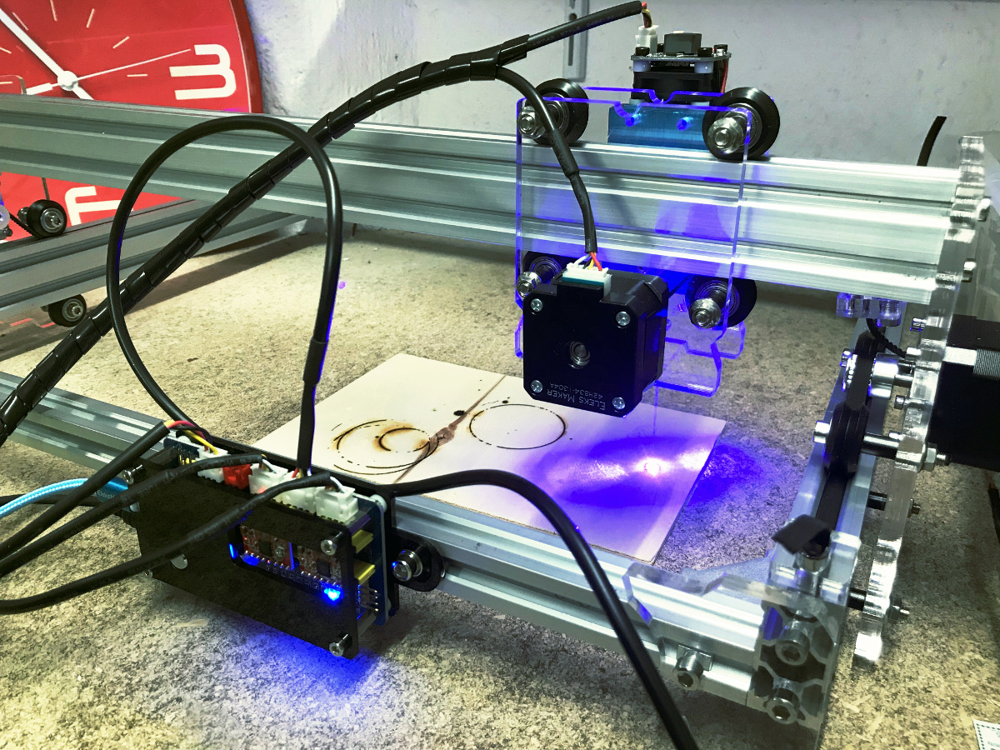
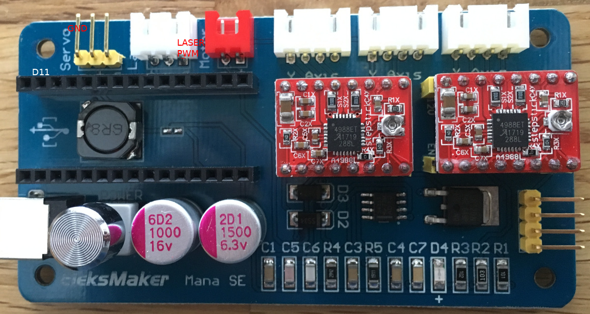
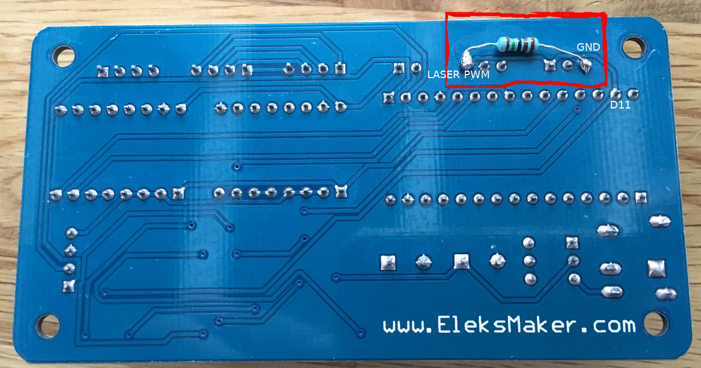
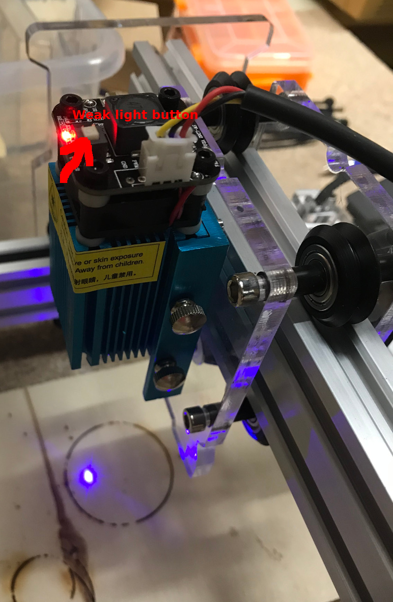

# Eleksmaker A3 laser engraver

I just finished the assembly of my Eleksmaker A3 laser engraver (2.5W).  These
are some notes for personal reference (I use Linux). Perhaps you find some
useful information too.



<!-- vim-markdown-toc GFM -->

* [Hardware](#hardware)
    * [Mana SE board](#mana-se-board)
        * [Safety improvement (laser pull down resistor)](#safety-improvement-laser-pull-down-resistor)
* [Firmware](#firmware)
    * [Flashing new firmware](#flashing-new-firmware)
        * [Pre-built images](#pre-built-images)
        * [Custom-build, using Arduino IDE](#custom-build-using-arduino-ide)
* [Testing the connection](#testing-the-connection)
* [Settings](#settings)
    * [Testing the laser](#testing-the-laser)
        * [Focus the laser](#focus-the-laser)
* [Modding](#modding)
* [Tools](#tools)
* [References](#references)

<!-- vim-markdown-toc -->

## Hardware

### Mana SE board



The Laser is connected to pin Arduino pin `D11` (both configured in
[GRBL firmware](https://github.com/gnea/grbl/wiki) and wired on [Mana
SE](http://wiki.eleksmaker.com/doku.php?id=eleksmana_se) board).

#### Safety improvement (laser pull down resistor)

As [others pointed
out](http://www.igregious.com/2017/10/eleksmaker-a3x-build-notes.html), to
avoid an uncontrolled laser-flash on power-on, it is advised to add a pull-down
resistor (1K to 2K):



## Firmware

### Flashing new firmware

The mana se board uses an Arduino Nano as MCU. So it's easy to update/change
the firmware with e.g. the Arduino IDE.

#### Pre-built images

I successfully used the [GRBL
v1.1f.20170701](https://github.com/gnea/grbl/releases/download/v1.1f.20170801/grbl_v1.1f.20170801.hex)
version.

Flash firmware using avrdude, e.g.  
  `avrdude -c arduino -b 57600 -P /dev/ttyUSB0 -p atmega328p -vv -U flash:w:grbl_v1.1f.20170801.hex`

#### Custom-build, using Arduino IDE

Download sources from https://github.com/gnea/grbl, install to
`~/Arduino/libraries` and open `grblUploader` example sketch in the Arduino IDE
afterwards. Compile & upload.

## Testing the connection

Start serial terminal connection with `screen /dev/ttyUSB0 115200`. Then
you have an interactive session with the GRBL firmware. Note that local echo
is off, i.e. you don't see what you enter. Commands typed in are in `<<CMD>>`
brackets. Example session:


```
$ screen /dev/ttyUSB0 115200
<<CTRL+X + ENTER>>
Grbl 1.1f ['$' for help]
<<$ + ENTER>>
[HLP:$$ $# $G $I $N $x=val $Nx=line $J=line $SLP $C $X $H ~ ! ? ctrl-x]
```

(Quit `screen` with `CTRL`+`A`+`\`)

## Settings

According to http://wiki.eleksmaker.com/doku.php?id=eleksrom, the default
settings are

* step mm 80 (`$100`,`$101`, `$102`)
* acceleration 200 (`$120`,`$121`, `$122`)
* Laser mode on (`$32`)

Read settings with command `$$` (see previous chapter).

```
<<$$ + ENTER>>
ok
$0=10
$1=25
$2=0
$3=0
$4=0
$5=0
$6=0
$10=1
$11=0.010
$12=0.002
$13=0
$20=0
$21=0
$22=0
$23=0
$24=25.000
$25=500.000
$26=250
$27=1.000
$30=255
$31=0
$32=1
$100=80.000
$101=80.000
$102=80.000
$110=1000.000
$111=1000.000
$112=10000.000
$120=200.000
$121=200.000
$122=200.000
$130=200.000
$131=200.000
$132=200.000
ok
```

### Testing the laser

Note: if not already done, put the protection glasses on now. And also make
sure there are no nearbys smoke alarms ;) 

To Turn laser on and off (make sure the _weak light button_ is not pressed):

```
M3     ; constant laser power mode
$32=0  ; Laser mode off
S255   ; 255 = FULL POWER ;)
S0     ; OFF
```

`M3` enables [constant laser power
mode](https://github.com/gnea/grbl/wiki/Grbl-v1.1-Laser-Mode).  `$S32=0` turns
the laser mode off, so `S255` has immedeate effect. Otherwise, when in laser
mode (`$32=1`), the laser will only be on during movements. Afterwards send a
`S0` to turn the laser off again.

#### Focus the laser

Use the `weak light button` and the focus wheel on the laser module to 
focus the laser. 



## Modding

* Marco Reps: https://www.youtube.com/watch?v=ZzO9skEYqwY / https://reps.cc/?p=5

## Tools

* [Universal Gcode Sender](https://github.com/winder/Universal-G-Code-Sender)
* [LaserWeb](https://github.com/LaserWeb/LaserWeb4)

## References

* [Grbl settings 101 - a how to guide](http://www.diymachining.com/grbl-settings-101-a-how-to-guide/)
* [Grbl v1.1 Configuration](https://github.com/gnea/grbl/wiki/Grbl-v1.1-Configuration)
